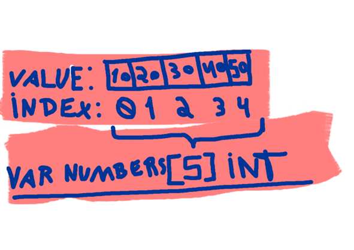
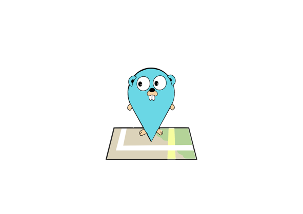

## Go lang: Arrays, Slices, and Maps Explained

Welcome to another exciting installment of our GO 101 series! Today we'll delve into arrays, slices, and maps. These data structures are fundamental in Go and mastering them will greatly enhance your development skills. So let's dive right in!

## Arrays

In Go, an array is a fixed-size sequence of elements of the same type. They provide a way to store and access multiple values under a single name. Here's an example of how to declare and initialize an array:

```go
var numbers [5]int // Declaring an array of 5 integers

numbers[0] = 10    // Assigning a value to the first element
numbers[1] = 20    // Assigning a value to the second element
numbers[2] = 30    // Assigning a value to the third element
numbers[3] = 40    // Assigning a value to the fourth element
numbers[4] = 50    // Assigning a value to the fifth element
```



Arrays in Go have a fixed length, which means you cannot change their size once they are defined. Accessing elements is done using zero-based indexing, where the first element is at index 0. Keep in mind that arrays in Go are value types, which means they are copied when assigned to a new variable or passed as function arguments.

## Slices

Slices in Go are more versatile than arrays. They are built on top of arrays and provide a dynamic, resizable view into the underlying array. Slices are created using a literal syntax or by slicing an existing array or another slice. Let's see some examples:

```go
// Using literal syntax to create a slice
fruits := []string{"apple", "banana", "orange", "kiwi"}

// Slicing an existing array to create a slice
numbers := [5]int{10, 20, 30, 40, 50}
numSlice := numbers[1:4] // Creates a slice from index 1 to 3 (excluding 4)

// Creating an empty slice with a predefined capacity
emptySlice := make([]int, 0, 10)

// Appending new elements to the slice
numSlice = append(numSlice, 60, 70, 80)

// Printing the slice
fmt.Println(numSlice) // Output: [20 30 40 60 70 80]
```

Slices are incredibly powerful because they can grow or shrink dynamically. They maintain a reference to the underlying array, and if the slice capacity is exceeded, a new larger array is allocated and the elements are copied over. This behavior allows for efficient memory utilization.

## Maps



Maps, also known as associative arrays or dictionaries, are unordered collections of key-value pairs. They provide an efficient way to retrieve and update values based on a unique key. In Go, maps are declared using the `map` keyword, and here's an example:

```go
ages := map[string]int{
    "John":  30,
    "Alice": 25,
    "Bob":   35,
}
```

In the above example, we have a map where the keys are of type `string` and the values are of type `int`. Maps are accessed using the square bracket notation, similar to arrays and slices, but instead of an index, we provide the key. If the key is not present, the map returns the zero value of the value type.

Maps in Go are references to hash tables, making them efficient for lookups and updates. They can also dynamically grow to accommodate more key-value pairs. However, it's important to note that maps are not safe for concurrent access by default. Proper synchronization is required when using maps concurrently.

## Conclusion

Congratulations on making it through this in-depth exploration of arrays, slices, and maps in Go! We've covered the basics

 of each data structure and highlighted their unique features and use cases. Arrays provide fixed-size collections, slices offer dynamic views into arrays, and maps excel at key-value lookups. Understanding these fundamental concepts will undoubtedly boost your Go programming skills.
