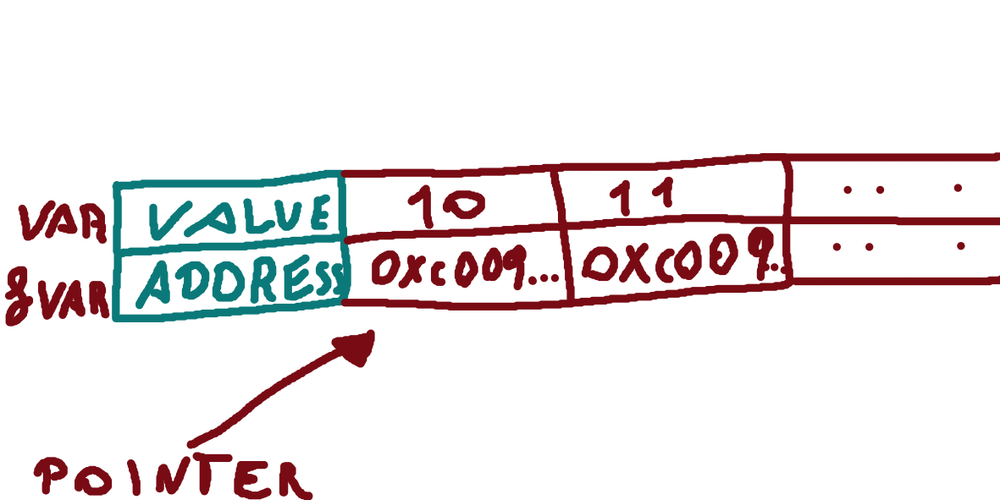
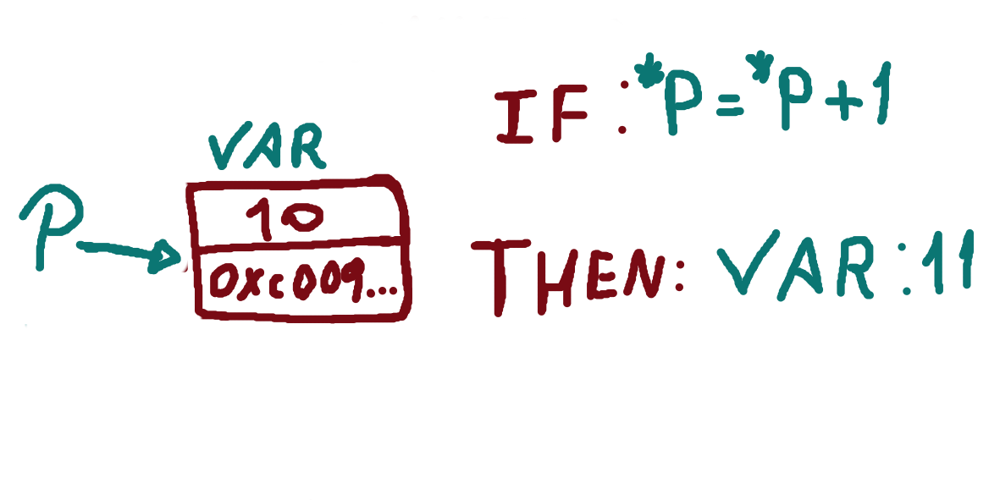

Continuing our Go programming 101 series:

Today we're going to discuss a fascinating topic that is relevant to almost all programming languages: value vs. reference (also known as *pointers*).

First and foremost, let's remember that every variable we create, regardless of its type, as well as arrays, slices, and maps, are allocated in memory.

Another crucial point to bear in mind is that function parameters are also variables.

To help us understand this concept better, let's create a function with two parameters. The first parameter will expect a value, while the second one will expect a pointer.

```go
func ValuePointer(value string, pointer *string) {
    fmt.Println(value)
    fmt.Println(pointer)
}
```

As we can see, whenever a parameter expects a pointer, we need to precede the data type with an asterisk (*). Now, in the `main` function, let's call the function we just created.

```go
package main

func main() {
    val := "value"
    ptr := "pointer"
    ValuePointer(val, &ptr)
}
```

In Go, when we want to pass the pointer of a variable that was created by value, we need to use the ampersand (&) before the variable name.

If you run `go run main.go`, you will probably get a similar result:

```makefile
value
0xc00009e210
```

This happens because when we pass a variable by value, a copy of that variable is created and passed into the function. However, when we pass a variable by pointer, only the memory reference where the value is stored is passed.



Let's delve into another example that demonstrates the practical use of pointers in Go programming:

```go
package main

import "fmt"

func main() {
    i, j := 2, 20

    p := &i         // point to i / i = 2
    fmt.Println(*p) // read i through the pointer / OUTPUT: 2
    *p = 10         // set i through the pointer
    fmt.Println(i)  // see the new value of i /  OUTPUT: 10

    p = &j         // point to j / j = 20
    *p = *p + i   // add j and i through the pointing j / i = 10 
    fmt.Println(j) // see the new value of j / OUTPUT: 30
}
```



Okay, but if a pointer doesn't create a copy of the data, then it might be tempting to pass everything by pointer to save memory, right?

Well, it's not that simple.

Let's take a closer look at another example.

```go
package main

import (
    "fmt"
)

type Person struct {
    Name string
    Age  int8
}

func ValuePointer(value Person, pointer *Person) {
    fmt.Printf("func: %s - %d\n", value.Name, value.Age)
    fmt.Printf("func: %s - %d\n", pointer.Name, pointer.Age)

    value.Age += 10
    pointer.Age += 10
}

func main() {
    person1 := Person{"Louis", 10}
    person2 := Person{"Josh", 11}

    ValuePointer(person1, &person2)

    fmt.Printf("out: %s - %d\n", person1.Name, person1.Age)
    fmt.Printf("out: %s - %d\n", person2.Name, person2.Age)
}
```

When we execute this program, we obtain the following result:

``` makefile
func: Louis - 10
func: Josh - 11
out: Louis - 10
out: Josh - 21
```

Since we passed `person2` by pointer, any changes made to the struct inside the function will be reflected outside, which may not always be the desired behavior.

Of course, there are cases where using pointers is highly advantageous. For example, when working with database connections, we can reuse an already open connection by using a pointer. Additionally, pointers can be useful in scenarios where we need to ensure that a specific object remains the same throughout the application, such as when handling a request.

However, it is essential to exercise caution when working with pointers. Misusing them can lead to unintended consequences and potential bugs in your code.

Feel free to leave your questions or comments below.

Until next time!
